<h1 align="center">TRANG WEB FEVIP SHOP </h1>

# 🌐 Giao diện chính của trang web

### 🏠 Trang chủ

  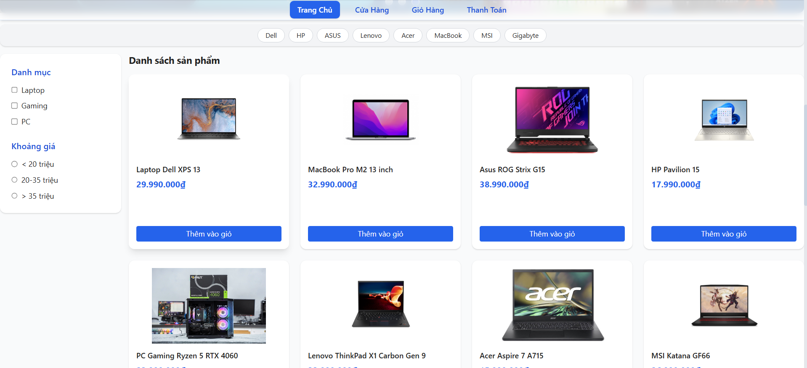

### 🏬 Trang Cửa Hàng

  

### 🛒 Trang Giỏ Hàng

  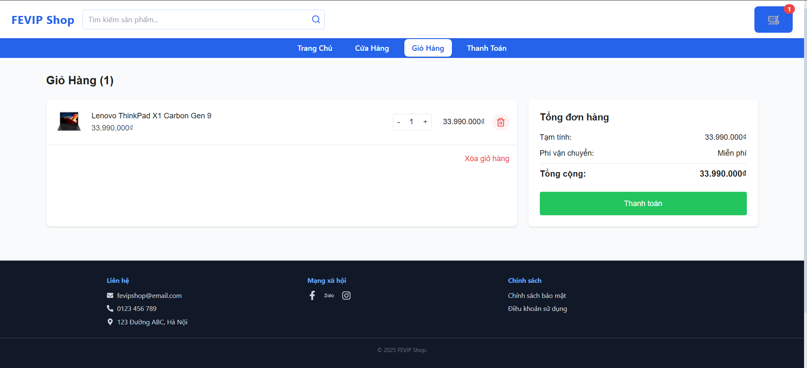

### 💳 Trang Thanh Toán

  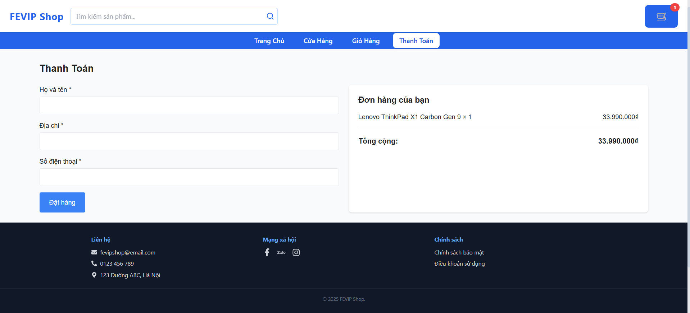

# 🧩Giao diện chức năng

### 🔍 Chức năng tìm kiếm sản phẩm

  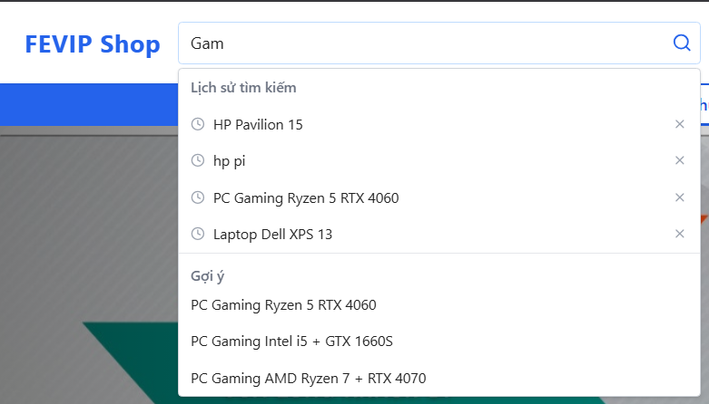

* Kết quả chức năng tìm kiếm sản phẩm

  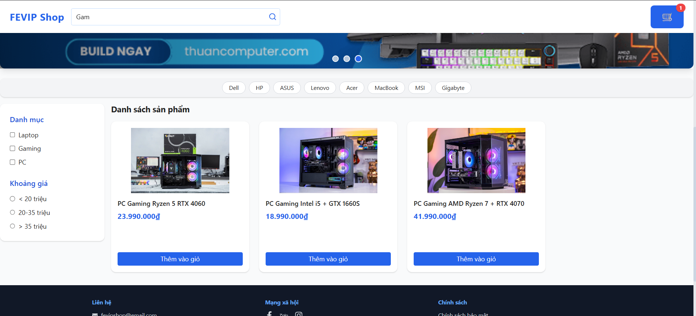

 

### 🧪 Chức năng lọc sản phẩm

  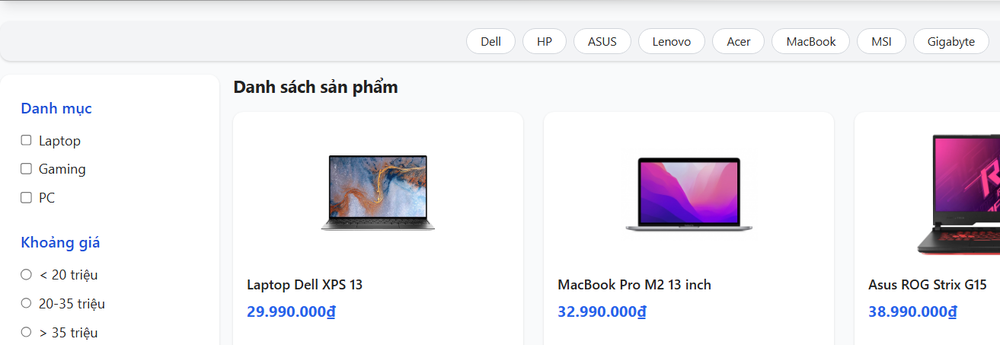

1. Kết quả chức năng lọc sản phẩm theo danh mục, khoảng giá

  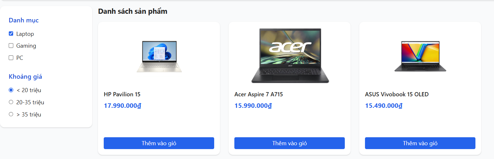

2. Kết quả chức năng lọc sản phẩm theo thương hiệu

  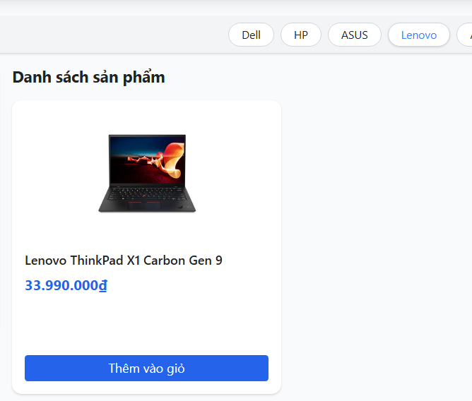

### 🪟 PopUp sản phẩm khi nhấn vào 1 thẻ sản phẩm

  

### 🛒 Chức năng Giỏ hàng
1. Thêm sản phẩm vào giỏ hàng

  

2. Sản phẩm đã thêm hiển thị trong giỏ hàng

  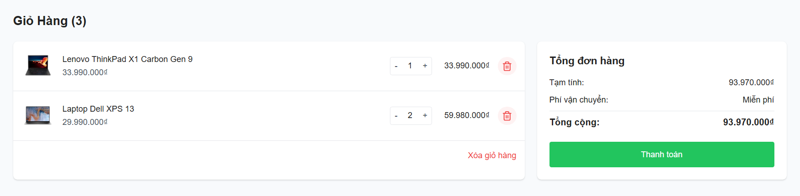

### 💳 Chức năng Thanh toán
1. Giao diện thanh toán

  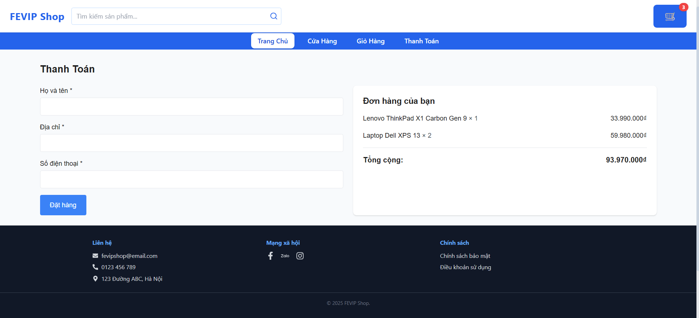

2. Hóa đơn thanh toán

  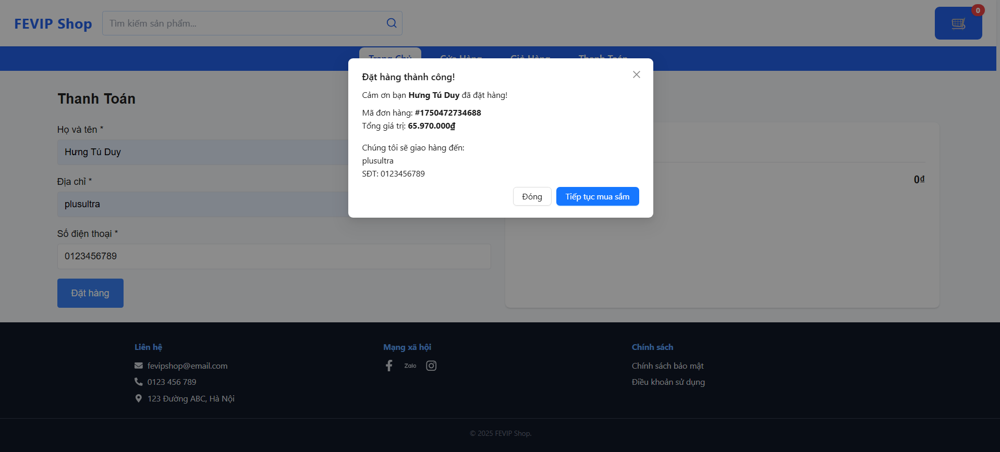

### 🤝 Đóng góp
Dự án được phát triển bởi 3 thành viên:

| Họ và Tên       | Vai trò                  |
|-----------------|--------------------------|
| Nguyễn Nam Hưng |Thực hiện chia trang bằng Router, Xây dựng Shop, xây dựng chức năng tìm kiếm sản phẩm, lưu lịch sử tìm kiếm bằng Local Storage và các bộ lọc sản phẩm|
| Lâm Ngọc Tú | Xây dựng các components và dựng giao diện nền, xây dựng trang chủ, tạo file products.json, thực hiện reponsive|
| Trần Trí Duy    | Xây dựng trang Giỏ hàng và Thanh toán, thực hiện các chức năng như thêm sửa xóa sản phẩm vào giỏ hàng, thanh toán giả lập và in ra hóa đơn, lưu giỏ hàng bằng Local Storage |

© 2025 NHÓM FEVIP, TRUNG TÂM CÔNG NGHỆ TRƯỜNG ĐẠI HỌC ĐẠI NAM